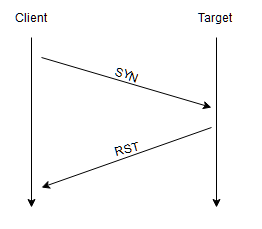

>## Introduction

When it comes to hacking, knowledge is power. The more knowledge you have about a target system or network, the more options you have available. This makes it imperative that proper enumeration is carried out before any exploitation attempts are made.

Say we have been given an IP (or multiple IP addresses) to perform a security audit on. Before we do anything else, we need to get an idea of the “landscape” we are attacking. What this means is that we need to establish which services are running on the targets. For example, perhaps one of them is running a webserver, and another is acting as a Windows Active Directory Domain Controller. The first stage in establishing this “map” of the landscape is something called port scanning. When a computer runs a network service, it opens a networking construct called a “port” to receive the connection.  Ports are necessary for making multiple network requests or having multiple services available. For example, when you load several webpages at once in a web browser, the program must have some way of determining which tab is loading which web page. This is done by establishing connections to the remote webservers using different ports on your local machine. Equally, if you want a server to be able to run more than one service (for example, perhaps you want your webserver to run both HTTP and HTTPS versions of the site), then you need some way to direct the traffic to the appropriate service. Once again, ports are the solution to this. Network connections are made between two ports – an open port listening on the server and a randomly selected port on your own computer. For example, when you connect to a web page, your computer may open port 49534 to connect to the server’s port 443.

As in the previous example, the diagram shows what happens when you connect to numerous websites at the same time. Your computer opens up a different, high-numbered port (at random), which it uses for all its communications with the remote server.

Every computer has a total of 65535 available ports; however, many of these are registered as standard ports. For example, a HTTP Webservice can nearly always be found on port 80 of the server. A HTTPS Webservice can be found on port 443. Windows NETBIOS can be found on port 139 and SMB can be found on port 445. It is important to note; however, that especially in a CTF setting, it is not unheard of for even these standard ports to be altered, making it even more imperative that we perform appropriate enumeration on the target.

If we do not know which of these ports a server has open, then we do not have a hope of successfully attacking the target; thus, it is crucial that we begin any attack with a port scan. This can be accomplished in a variety of ways – usually using a tool called nmap, which is the focus of this room. Nmap can be used to perform many different kinds of port scan – the most common of these will be introduced in upcoming tasks; however, the basic theory is this: nmap will connect to each port of the target in turn. Depending on how the port responds, it can be determined as being open, closed, or filtered (usually by a firewall). Once we know which ports are open, we can then look at enumerating which services are running on each port – either manually, or more commonly using nmap.

So, why nmap? The short answer is that it's currently the industry standard for a reason: no other port scanning tool comes close to matching its functionality (although some newcomers are now matching it for speed). It is an extremely powerful tool – made even more powerful by its scripting engine which can be used to scan for vulnerabilities, and in some cases even perform the exploit directly! Once again, this will be covered more in upcoming tasks.

For now, it is important that you understand: what port scanning is; why it is necessary; and that nmap is the tool of choice for any kind of initial enumeration.

> ### Answer the questions below

1. What networking constructs are used to direct traffic to the right application on a server? \
Answer : Ports

2. How many of these are available on any network-enabled computer? \
Answer : 65535

3. [Research] How many of these are considered "well-known"? (These are the "standard" numbers mentioned in the task) \
Answer : 1024

> ## Nmap Switches

Like most pentesting tools, nmap is run from the terminal. There are versions available for both Windows and Linux. For this room we will assume that you are using Linux; however, the switches should be identical. Nmap is installed by default in both Kali Linux and the TryHackMe Attack Box.

Nmap can be accessed by typing **nmap** into the terminal command line, followed by some of the "switches" (command arguments which tell a program to do different things) we will be covering below.

All you'll need for this is the help menu for nmap (accessed with **nmap -h**) and/or the nmap man page (access with **man nmap**). For each answer, include all parts of the switch unless otherwise specified. This includes the hyphen at the start (**-**).

> ### Answer the questions below

1. What is the first switch listed in the help menu for a 'Syn Scan' (more on this later!)? \
Answer : -ss

2. Which switch would you use for a "UDP scan"? \
Answer : -sU

3. If you wanted to detect which operating system the target is running on, which switch would you use? \
Answer : -O
 
4. Nmap provides a switch to detect the version of the services running on the target. What is this switch? \
Answer : -sV
 
5. The default output provided by nmap often does not provide enough information for a pentester. How would you increase the verbosity? \
Answer : -v

6. Verbosity level one is good, but verbosity level two is better! How would you set the verbosity level to two?
(Note: it's highly advisable to always use at least this option) \
Answer : -vv

7. We should always save the output of our scans -- this means that we only need to run the scan once (reducing network traffic and thus chance of detection), and gives us a reference to use when writing reports for clients. \
What switch would you use to save the nmap results in three major formats? \
Answer -oA

8. What switch would you use to save the nmap results in a "normal" format? \
Answer : -oN

9. A very useful output format: how would you save results in a "grepable" format? \
Answer : -oG

10. Sometimes the results we're getting just aren't enough. If we don't care about how loud we are, we can enable "aggressive" mode. This is a shorthand switch that activates service detection, operating system detection, a traceroute and common script scanning. \
How would you activate this setting? \
Answer : -A

11. Nmap offers five levels of "timing" template. These are essentially used to increase the speed your scan runs at. Be careful though: higher speeds are noisier, and can incur errors! \
How would you set the timing template to level 5? \
Answer : -T5

12. We can also choose which port(s) to scan. \
How would you tell nmap to only scan port 80? \
Answer : -p 80

13. How would you tell nmap to scan ports 1000-1500? \
Answer : -p 1000-1500

14. A very useful option that should not be ignored: \
How would you tell nmap to scan all ports? \
Answer : -p-

15. How would you activate a script from the nmap scripting library (lots more on this later!)? \
Answer : --script

16. How would you activate all of the scripts in the "vuln" category? \
Answer : --script=vuln

> ## Scan Types Overview

hen port scanning with Nmap, there are three basic scan types. These are:

- TCP Connect Scans (**-sT**)
- SYN "Half-open" Scans (**-sS**)
- UDP Scans (**-sU**)

Additionally there are several less common port scan types, some of which we will also cover (albeit in less detail). These are:

- TCP Null Scans (**-sN**)
- TCP FIN Scans (**-sF**)
- TCP Xmas Scans (**-sX**)

Most of these (with the exception of UDP scans) are used for very similar purposes, however, the way that they work differs between each scan. This means that, whilst one of the first three scans are likely to be your go-to in most situations, it's worth bearing in mind that other scan types exist.

In terms of network scanning, we will also look briefly at ICMP (or "ping") scanning.

> ## Scan Types TCP Connect Scans

To understand TCP Connect scans (**-sT**), it's important that you're comfortable with the TCP three-way handshake. If this term is new to you then completing Introductory Networking before continuing would be advisable.

As a brief recap, the three-way handshake consists of three stages. First the connecting terminal (our attacking machine, in this instance) sends a TCP request to the target server with the SYN flag set. The server then acknowledges this packet with a TCP response containing the SYN flag, as well as the ACK flag. Finally, our terminal completes the handshake by sending a TCP request with the ACK flag set.

This is one of the fundamental principles of TCP/IP networking, but how does it relate to Nmap?

Well, as the name suggests, a TCP Connect scan works by performing the three-way handshake with each target port in turn. In other words, Nmap tries to connect to each specified TCP port, and determines whether the service is open by the response it receives.

For example, if a port is closed, RFC 9293 states that:

"... If the connection does not exist (CLOSED), then a reset is sent in response to any incoming segment except another reset. A SYN segment that does not match an existing connection is rejected by this means."

In other words, if Nmap sends a TCP request with the SYN flag set to a closed port, the target server will respond with a TCP packet with the RST (Reset) flag set. By this response, Nmap can establish that the port is closed.

If, however, the request is sent to an open port, the target will respond with a TCP packet with the SYN/ACK flags set. Nmap then marks this port as being open (and completes the handshake by sending back a TCP packet with ACK set).

This is all well and good, however, there is a third possibility.

What if the port is open, but hidden behind a firewall?

Many firewalls are configured to simply drop incoming packets. Nmap sends a TCP SYN request, and receives nothing back. This indicates that the port is being protected by a firewall and thus the port is considered to be filtered.

That said, it is very easy to configure a firewall to respond with a RST TCP packet. For example, in IPtables for Linux, a simple version of the command would be as follows:

> **iptables -I INPUT -p tcp --dport <port> -j REJECT --reject-with tcp-reset**

This can make it extremely difficult (if not impossible) to get an accurate reading of the target(s).

> ### Answer the questions below

1. Which RFC defines the appropriate behaviour for the TCP protocol? \
Answer : RFC 9293

2. If a port is closed, which flag should the server send back to indicate this? \
Answer : RST

